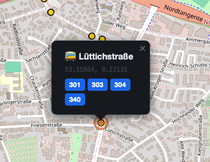

# Jet Lag Maps – Hide & Seek

> An interactive map tool for the board game [Jet Lag: The Game – Hide & Seek](https://store.nebula.tv/collections/jetlag/products/hideandseek).
> Plan your game with live OpenStreetMap data: city boundaries, postal codes, hospitals, train stations, bus lines, and much more – fully printable as A4 PDF. Includes a colour-blind safe palette.

**[▶ Open the live app](https://cniehaus.github.io/hideandseek-map/)**


---

## Features

### Map layers
**22 toggleable layers** across three categories:

| Category | Layers |
|---|---|
| City overview | City boundary, Postal codes |
| Transport | Train & tram stations, Bus stops |
| Emergency & civic | Hospitals, Police stations, Fire stations, Town halls, Embassies, Consulates |
| Culture & leisure | Attractions, Cinemas, Zoos, Aquariums, Libraries, Golf courses, Stadiums |
| Nature & amenity | Parks, Water bodies, Cemeteries, Swimming pools |
| Commerce | Shopping centres |

Clicking any **bus stop** shows a popup listing every bus line that serves it – fetched live from OpenStreetMap:



### City boundary layer *(new)*
Toggle the **Stadtgrenze / City Boundary** layer to draw the administrative outline of the searched city as a thick dashed line with no fill. Useful for quickly checking whether the hider is still inside the game area. The boundary is fetched using the exact OSM relation ID returned by Nominatim, so it matches the city precisely.

### Bus route lines
Draw any bus (or tram) line by number directly on the map. Type a line number such as **305** in the *Bus-Linien* section and click *Einzeichnen* – the full route appears as a coloured line. Multiple lines can be shown at once, each with its own colour.

### Radius & interval tool
Draw a circle of any radius around a chosen centre point – or a set of evenly-spaced rings for interval-based rules.

**Radii are draggable** – grab the centre dot and move the whole circle to a new position without redrawing it.

### Distance & direction tool
Click two points (A then B) to get the Haversine distance and compass bearing. The result is shown with two semicircle zones.

**Both markers are draggable** – move A or B after placing them; distance, bearing, and zones update in real time.

### Click-point marker
Every map click sets a centre point for the radius tool and marks it with a crosshair symbol so you always know where the last click landed.

### Colour-blind safe palette *(new)*
The map style popover (🗺 button) now includes a **Colour palette** toggle with two options:

- **Default** – the original vivid colours
- **Colour-blind safe** – based on the [Okabe-Ito](https://jfly.uni-koeln.de/color/) and [Paul Tol](https://personal.sron.nl/~pault/) palettes, designed to be distinguishable under deuteranopia and protanopia (red-green colour blindness). Replaces pure red/green pairs with vermillion/teal equivalents throughout all layers, postal-code zones, interval rings, and bus route lines.

The choice is persisted in `localStorage` and switching palettes instantly re-colours any active layers without re-fetching data.

### Map styles & printing
6 map styles (OSM Standard, Positron, Dark, Voyager, Satellite, ÖPNV). Print-ready A4 PDF via the browser print dialog.

### Bilingual
English and German, auto-detected from browser locale. Switch at any time with the DE / EN buttons.

---

## Tech Stack

| What | Library / API |
|---|---|
| Map rendering | [Leaflet 1.9](https://leafletjs.com/) |
| Map tiles | OpenStreetMap, CARTO, Esri, memomaps |
| POI & route data | [Overpass API](https://overpass-api.de/) (with 3-endpoint fallback) |
| Geocoding | [Nominatim](https://nominatim.openstreetmap.org/) |
| OSM → GeoJSON | [osmtogeojson](https://github.com/tyrasd/osmtogeojson) |
| Languages | Plain JS objects (`langs/de.js`, `langs/en.js`) |

No build step, no bundler, no framework. Just HTML + CSS + vanilla JS.

---

## Project Structure

```
hideandseek-map/
├── index.html          # Shell: HTML layout + <script> load order
├── style.css           # All styles (sidebar, map, print)
│
├── langs/
│   ├── de.js           # German translations (LANG_DE object)
│   └── en.js           # English translations (LANG_EN object)
│
└── js/
    ├── config.js       # Constants: tile URLs, COLOR_THEMES (default + colorblind), Overpass endpoints
    ├── i18n.js         # t(), tf(), switchLang(), applyI18n()
    ├── map.js          # Leaflet map init + setTileLayer()
    ├── overpass.js     # overpassFetch() – POST with endpoint fallback
    ├── renderers.js    # renderPLZ(), renderPOIs(), renderWater(), renderCityBoundary()
    ├── layers.js       # LAYER_DEFS (all POI filters) + layer management + recolorActiveLayers()
    ├── city.js         # searchCity() + km/mi unit helpers (stores OSM relation ID)
    ├── busroutes.js    # Bus/tram route line tool
    ├── radius.js       # Radius / interval circle tool (draggable)
    ├── measure.js      # Distance & bearing tool + map click handler (draggable)
    ├── permalink.js    # Shareable URL state
    └── ui.js           # Sidebar, print, error popup, style FAB, setColorMode()
```

The most important file for contributors is **`js/layers.js`** – it contains the complete definition of every map layer (Overpass query + colour + icon + renderer reference) in one place.

Colour definitions live in **`js/config.js`** inside `COLOR_THEMES`. Both `default` and `colorblind` objects follow the same structure (`plz`, `interval`, `busRoute`, and `layers` sub-keys), so adding a third theme is straightforward.

---

## Running Locally

No install needed.

```bash
git clone https://github.com/cniehaus/hideandseek-map.git
cd hideandseek-map
```

Then open `index.html` in your browser – or serve it with any static file server:

```bash
# Python
python3 -m http.server 8080

# Node.js
npx serve .
```

**Note:** The Overpass API blocks requests from `file://` in some browsers (CORS). Use the local server method if you see network errors.

---

## Contributing

Contributions are very welcome! Here are the most impactful areas:

### Add a new map layer (easiest start)

Each layer is a single object in `LAYER_DEFS` inside `js/layers.js`. To add one:

1. Pick an [Overpass QL](https://wiki.openstreetmap.org/wiki/Overpass_API/Overpass_QL) query that returns the features you want.
2. Add an entry to `LAYER_DEFS`:

```js
// js/layers.js
my_layer: {
    label: 'lyr_my_layer',       // translation key
    color: '#a855f7',            // marker / polygon colour
    icon:  '🏪',                 // emoji shown in popups
    buildQuery: (bb) => `[out:json][timeout:60];
(
  node(${bb[0]},${bb[2]},${bb[1]},${bb[3]})["amenity"="my_tag"];
  way(${bb[0]},${bb[2]},${bb[1]},${bb[3]})["amenity"="my_tag"];
);
out center bb tags;`,
    render: renderPOIs,          // use renderPOIs for point features
},
```

3. Add a checkbox to `index.html` (copy any existing `<label class="layer-row">` block).
4. Add translation strings to both `langs/de.js` and `langs/en.js`.

That's it – no other code changes needed.

### Other good first issues

- **New map style** – add a tile provider to `TILE_LAYERS` in `js/config.js` and a button to the style popover in `index.html`
- **Additional languages** – create `langs/xx.js` following the same structure as `de.js`, add the detection logic in `index.html` (`<head>`)
- **Improved Overpass queries** – the existing queries are functional but not exhaustive; PRs that improve recall or reduce noise are welcome
- **Mobile UX** – layout and touch behaviour on small screens can always improve
- **Accessibility** – ARIA labels, keyboard navigation, colour-contrast improvements
- **Additional colour themes** – add a third entry to `COLOR_THEMES` in `js/config.js` (e.g. a high-contrast theme) and a button in the style popover; the rest of the system picks it up automatically

### Sending a Pull Request

1. Fork the repository
2. Create a feature branch: `git checkout -b feature/my-new-layer`
3. Make your changes – no build step required
4. Open a Pull Request against `main` and describe what you changed and why

Please keep PRs focused: one layer (or one feature) per PR makes review much faster.

---

## Translation Guide

All user-visible strings live in `langs/de.js` (`LANG_DE`) and `langs/en.js` (`LANG_EN`). The keys are identical in both files.

```js
// langs/en.js
lyr_my_layer: 'My Layer Name',

// langs/de.js
lyr_my_layer: 'Mein Layer-Name',
```

Strings with placeholders use `{0}`, `{1}`, … and are called with `tf('key', value0, value1)`.

---

## Data & Privacy

- All geodata comes from [OpenStreetMap](https://www.openstreetmap.org/) (© OpenStreetMap contributors, ODbL).
- Geocoding requests go to the Nominatim service operated by the OSM Foundation.
- No user data is stored or transmitted to any server operated by this project.

---

## License

[GNU General Public License v3.0](LICENSE) – free to use, modify, and redistribute under the same licence.
